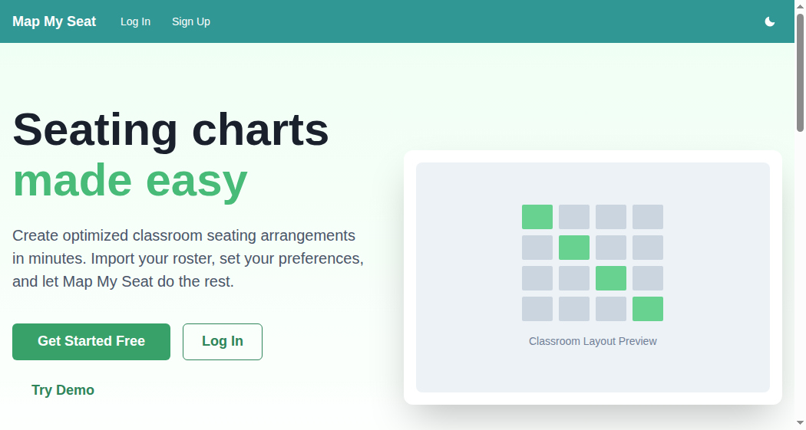
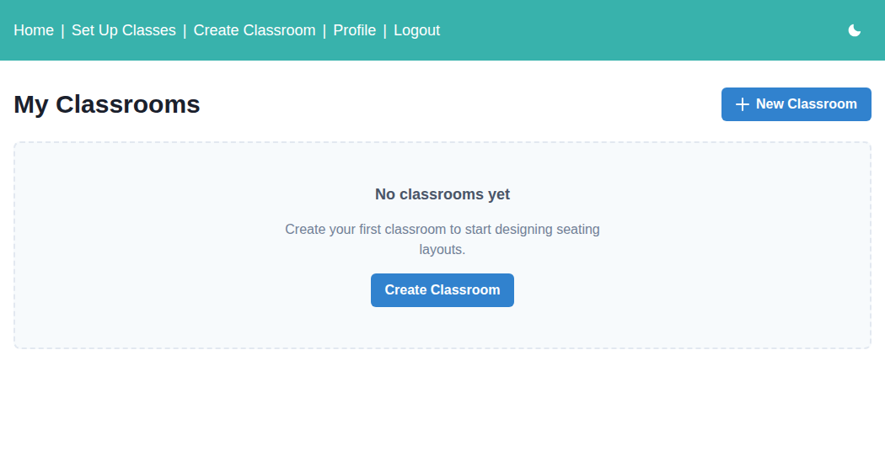

# Map My Seat

**Automated seating chart generator for K-12 teachers**

[Live Demo](https://map-my-seat.vercel.app/) | [Try Demo Mode](#try-it-out)

---

## Overview

Map My Seat helps K-12 teachers create optimized seating charts in minutes, not hours. Input your students, design your classroom layout, and let the app generate intelligent seating arrangements based on your preferences.

## Screenshots

| Landing Page | Classroom Setup | Seating Chart |
|--------------|-----------------|---------------|
|  |  |  |

*Note: To add screenshots, run the app and capture images to `docs/screenshots/`*

## Features

- **Smart Seating Algorithms** - Alphabetical, randomized, high-low academic pairing, male-female alternating
- **Student Accommodations** - Priority seating for ESE, ELL, 504, and EBD students
- **Flexible Classroom Layouts** - Design any desk arrangement with drag-and-drop
- **Multiple Class Periods** - Manage students across all your classes
- **Seating Constraints** - Keep students together or apart as needed
- **Dark Mode** - Easy on the eyes for late-night planning
- **Demo Mode** - Explore the full app without creating an account

## Try It Out

### Option 1: Demo Mode (No signup required)
Visit the [live app](https://map-my-seat.vercel.app/) and click **"Try Demo"** to explore with sample data.

### Option 2: Local Development
```bash
# Clone and install
git clone https://github.com/your-username/map-my-seat.git
cd map-my-seat
npm run install:all

# Configure environment
cp .env.example .env
# Edit .env with your PostgreSQL credentials

# Start development servers
npm run dev
```

This starts:
- Frontend: http://localhost:5173
- Backend API: http://localhost:3001

## User Flow

1. **Sign Up** - Create your teacher account
2. **Add Classes** - Enter your class periods with titles
3. **Add Students** - Register students for each class with optional accommodation flags
4. **Design Classroom** - Create your desk layout on the grid
5. **Set Preferences** - Choose seating algorithm and priorities
6. **Generate Chart** - Get your optimized seating arrangement instantly

## Technology Stack

| Layer | Technology |
|-------|------------|
| Frontend | React 18, Vite, Chakra UI, React Router v6 |
| Backend | Node.js, Express, Knex.js |
| Database | PostgreSQL |
| Auth | JWT tokens |
| Deployment | Vercel (serverless) |

### Performance Features

- **Code Splitting** - Routes load on-demand with React.lazy()
- **Loading Skeletons** - Smooth visual feedback during navigation
- **Optimized Bundle** - Tree-shaking and minification via Vite

## API Documentation

The backend provides a RESTful API for all operations.

### Authentication
All protected routes require a JWT token in the Authorization header:
```
Authorization: Bearer <token>
```

### Endpoints

#### Auth
| Method | Endpoint | Description |
|--------|----------|-------------|
| POST | `/auth/register` | Create new user account |
| POST | `/auth/token` | Login and receive JWT |

#### Users
| Method | Endpoint | Description |
|--------|----------|-------------|
| GET | `/users/:username` | Get user profile |
| PATCH | `/users/:username` | Update user profile |
| DELETE | `/users/:username` | Delete user account |

#### Periods (Classes)
| Method | Endpoint | Description |
|--------|----------|-------------|
| GET | `/periods/:username` | List all periods |
| POST | `/periods/:username` | Create new period |
| GET | `/periods/:username/:periodId` | Get period details |
| PATCH | `/periods/:username/:periodId` | Update period |
| DELETE | `/periods/:username/:periodId` | Delete period |

#### Students
| Method | Endpoint | Description |
|--------|----------|-------------|
| GET | `/periods/:username/:periodId/students` | List students in period |
| POST | `/periods/:username/:periodId/students` | Add student to period |
| PATCH | `/periods/:username/:periodId/students/:studentId` | Update student |
| DELETE | `/periods/:username/:periodId/students/:studentId` | Remove student |

#### Classrooms
| Method | Endpoint | Description |
|--------|----------|-------------|
| GET | `/classrooms/:username` | List all classrooms |
| POST | `/classrooms/:username` | Create classroom |
| GET | `/classrooms/:username/:classroomId` | Get classroom details |
| PATCH | `/classrooms/:username/:classroomId` | Update classroom |
| DELETE | `/classrooms/:username/:classroomId` | Delete classroom |

#### Seating Charts
| Method | Endpoint | Description |
|--------|----------|-------------|
| GET | `/classrooms/:username/:classroomId/seating-charts` | List charts |
| POST | `/classrooms/:username/:classroomId/seating-charts` | Generate chart |
| GET | `/classrooms/:username/:classroomId/seating-charts/:id` | Get chart |
| PATCH | `/classrooms/:username/:classroomId/seating-charts/:id` | Update chart |
| DELETE | `/classrooms/:username/:classroomId/seating-charts/:id` | Delete chart |

#### Constraints
| Method | Endpoint | Description |
|--------|----------|-------------|
| GET | `/constraints/:username/:periodId` | List constraints |
| POST | `/constraints/:username/:periodId` | Create constraint |
| DELETE | `/constraints/:username/:periodId/:constraintId` | Delete constraint |

## Testing

Tests are colocated with source files (`*.test.js`, `*.test.jsx`).

```bash
# Run all tests
npm test

# Run backend tests only
npm run test:backend

# Run frontend tests only
npm run test:frontend

# Run with coverage
cd frontend && npm run test:coverage
```

## Project Structure

```
map-my-seat/
├── api/                    # Vercel serverless functions
├── backend/
│   ├── middleware/         # Auth, error handling
│   ├── models/             # Database operations
│   ├── routes/             # API endpoints
│   └── schemas/            # JSON Schema validation
├── frontend/
│   ├── src/
│   │   ├── auth/           # Login, signup, context
│   │   ├── classroom/      # Classroom components
│   │   ├── common/         # Shared components
│   │   ├── demo/           # Demo mode context
│   │   ├── home/           # Landing page
│   │   ├── hooks/          # Custom React hooks
│   │   ├── navigation/     # Nav components
│   │   ├── periods/        # Period management
│   │   ├── profile/        # User profile
│   │   ├── routes/         # Router config
│   │   ├── seating/        # Seating chart
│   │   └── students/       # Student management
│   └── vite.config.js
├── vercel.json             # Deployment config
└── package.json            # Monorepo scripts
```

## Deployment

This project is optimized for Vercel with serverless functions.

1. **Database**: Set up PostgreSQL (Neon, Supabase, or similar)
2. **Deploy**: Connect GitHub repo to Vercel
3. **Configure**: Add environment variables in Vercel dashboard
   - `DATABASE_URL` - PostgreSQL connection string
   - `SECRET_KEY` - JWT signing key
4. **Done**: Your app is live!

See [DEPLOYMENT.md](./DEPLOYMENT.md) for detailed instructions.

## Contributing

Contributions are welcome! Please read the codebase conventions in [CLAUDE.md](./CLAUDE.md) before submitting PRs.

## License

MIT

---

Built with care for educators everywhere.
