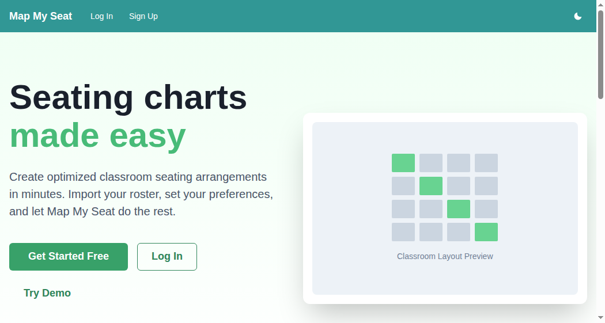
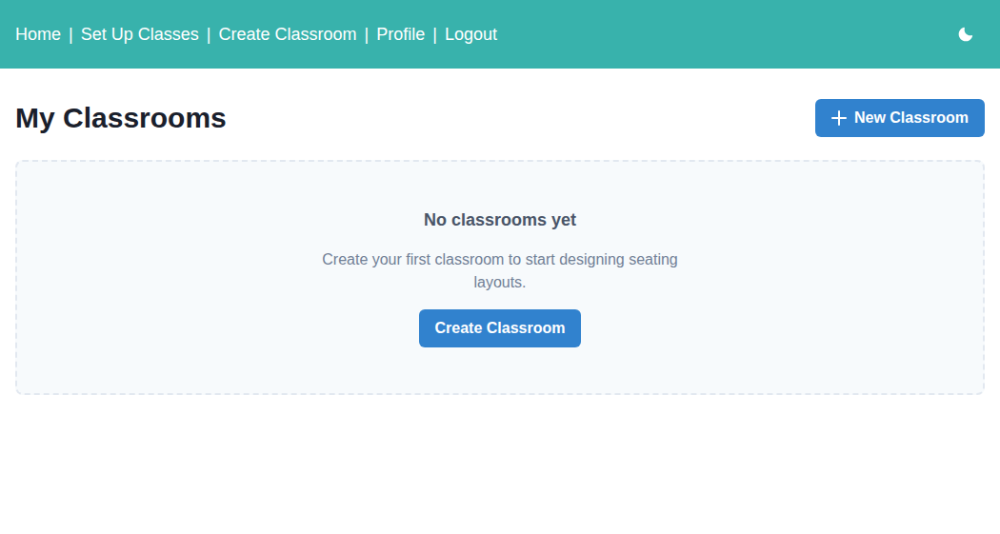
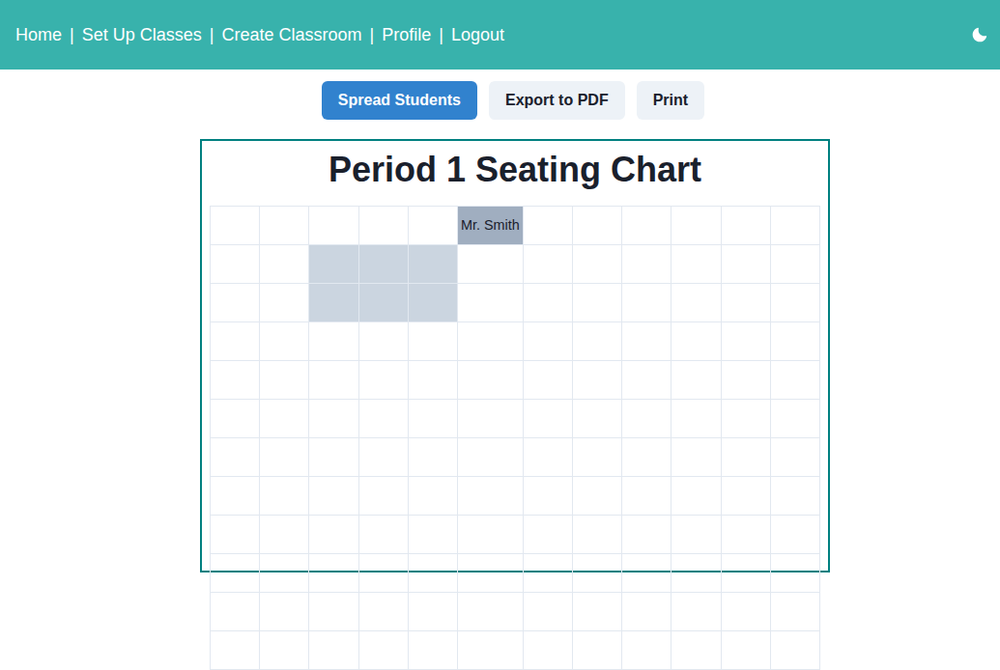

<h1 align="center">Map My Seat</h1>

<p align="center">
  <strong>Automated seating chart generator for K-12 teachers</strong>
</p>

<p align="center">
  <a href="https://map-my-seat.vercel.app/">Live Demo</a> &bull;
  <a href="#try-it-out">Try Demo Mode</a> &bull;
  <a href="#api-documentation">API Docs</a>
</p>

<p align="center">
  
  
  
  
  
</p>

---

## Overview

Map My Seat helps K-12 teachers create optimized seating charts in minutes, not hours. Import your roster, design your classroom layout, set your preferences, and generate intelligent seating arrangements that respect student accommodations and teacher constraints.

## Screenshots

| Landing Page | Classroom Setup | Seating Chart |
|:---:|:---:|:---:|
|  |  |  |

> To add screenshots, run the app and save images to `docs/screenshots/`.

## Key Features

- **Smart Seating Algorithms** - Alphabetical, randomized, high-low academic pairing, male-female alternating
- **Student Accommodations** - Priority seating for ESE, ELL, 504, and EBD students
- **Seating Constraints** - Keep specific students together or apart
- **Flexible Layouts** - Design any desk arrangement on a grid editor
- **Multiple Classrooms** - Manage different room configurations
- **CSV Import** - Bulk-upload student rosters via gradebook export
- **PDF Export** - Print-ready seating chart output
- **Dark Mode** - Full light/dark theme support
- **Demo Mode** - Explore every feature without creating an account

## Try It Out

**Option 1: Demo Mode** (no signup required)
Visit the [live app](https://map-my-seat.vercel.app/) and click **"Try Demo"** to explore with sample data.

**Option 2: Local Development**
```bash
git clone https://github.com/gilhooley/map-my-seat.git
cd map-my-seat
npm run install:all

# Configure environment
cp .env.example .env
# Edit .env with your PostgreSQL credentials

# Run migrations
npm run migrate

# Start development servers
npm run dev
```

This starts:
- **Frontend:** http://localhost:5173
- **Backend API:** http://localhost:3001

## Architecture

```
┌─────────────────────────────────────────────────────┐
│                    Frontend (React)                   │
│  Vite  ·  Chakra UI  ·  React Router  ·  Axios      │
└──────────────────────┬──────────────────────────────┘
                       │ REST API (JSON)
┌──────────────────────▼──────────────────────────────┐
│                   Backend (Express)                   │
│  JWT Auth  ·  JSON Schema  ·  Helmet  ·  Rate Limit │
└──────────────────────┬──────────────────────────────┘
                       │ Knex.js Query Builder
┌──────────────────────▼──────────────────────────────┐
│                   PostgreSQL                          │
│  Users  ·  Periods  ·  Students  ·  Classrooms       │
│  Seating Charts  ·  Student Constraints              │
└─────────────────────────────────────────────────────┘
```

| Layer | Technology |
|-------|------------|
| Frontend | React 18, Vite, Chakra UI, React Router v6, Framer Motion |
| Backend | Node.js 18, Express, Knex.js, JSON Schema validation |
| Database | PostgreSQL with versioned migrations |
| Auth | JWT with bcrypt password hashing, rate-limited endpoints |
| Security | Helmet.js, CORS, rate limiting, input validation |
| Deployment | Vercel (frontend + serverless functions) |

### Design Decisions

- **Code splitting** via React.lazy() for fast initial page loads
- **Skeleton loading states** for smooth perceived performance
- **Autosave** on classroom layout changes to prevent data loss
- **Demo mode** with full in-memory data simulation (no backend required)
- **RESTful API** with consistent error codes and JSON Schema validation

## User Flow

1. **Sign Up** - Create your teacher account
2. **Add Classes** - Enter your class periods and school year
3. **Add Students** - Import rosters via CSV or add students manually with accommodation flags
4. **Set Constraints** - Specify which students should sit together or apart
5. **Design Classroom** - Build your desk layout on the grid editor
6. **Set Preferences** - Choose seating algorithm and accommodation priorities
7. **Generate Charts** - Get optimized seating arrangements instantly
8. **Export** - Download as PDF for printing

## API Documentation

All protected routes require a JWT token:
```
Authorization: Bearer <token>
```

### Auth
| Method | Endpoint | Description |
|--------|----------|-------------|
| POST | `/auth/register` | Create new account |
| POST | `/auth/token` | Login and receive JWT |

### Users
| Method | Endpoint | Description |
|--------|----------|-------------|
| GET | `/users/:username` | Get user profile |
| PATCH | `/users/:username` | Update profile |
| DELETE | `/users/:username` | Delete account |

### Periods
| Method | Endpoint | Description |
|--------|----------|-------------|
| GET | `/periods/:username` | List all periods |
| POST | `/periods/:username` | Create period |
| GET | `/periods/:username/:periodId` | Get period with students |
| PATCH | `/periods/:username/:periodId` | Update period |
| DELETE | `/periods/:username/:periodId` | Delete period |

### Students
| Method | Endpoint | Description |
|--------|----------|-------------|
| POST | `/periods/:username/:periodId/students` | Add student |
| PATCH | `/periods/:username/:periodId/students/:studentId` | Update student |
| DELETE | `/periods/:username/:periodId/students/:studentId` | Remove student |

### Classrooms
| Method | Endpoint | Description |
|--------|----------|-------------|
| GET | `/classrooms/:username/all` | List classrooms |
| POST | `/classrooms/:username` | Create classroom |
| PATCH | `/classrooms/:username/:classroomId` | Update classroom |
| DELETE | `/classrooms/:username/:classroomId` | Delete classroom |

### Seating Charts
| Method | Endpoint | Description |
|--------|----------|-------------|
| GET | `/classrooms/:username/:classroomId/seating-charts` | List charts |
| POST | `/classrooms/:username/:classroomId/seating-charts` | Generate chart |
| GET | `/classrooms/:username/:classroomId/seating-charts/:id` | Get chart |
| PATCH | `/classrooms/:username/:classroomId/seating-charts/:id` | Update chart |
| DELETE | `/classrooms/:username/:classroomId/seating-charts/:id` | Delete chart |

### Constraints
| Method | Endpoint | Description |
|--------|----------|-------------|
| GET | `/constraints/:username/:periodId` | List constraints |
| POST | `/constraints/:username/:periodId` | Create constraint |
| DELETE | `/constraints/:username/:periodId/:constraintId` | Delete constraint |

## Testing

Tests are colocated with source files. Backend uses Jest; frontend uses Vitest with React Testing Library.

```bash
npm test                  # Run all tests
npm run test:backend      # Backend only
npm run test:frontend     # Frontend only
```

### Coverage areas:
- **Backend:** Models, routes, middleware, helpers, error handling, migrations
- **Frontend:** Components, hooks, contexts, API layer, seating algorithms

## Project Structure

```
map-my-seat/
├── backend/
│   ├── middleware/        # JWT auth & authorization guards
│   ├── models/            # Database CRUD operations
│   ├── routes/            # RESTful API endpoints
│   ├── schemas/           # JSON Schema request validation
│   ├── helpers/           # Token generation, SQL utilities
│   └── migrations/        # Versioned database schema
├── frontend/
│   └── src/
│       ├── auth/          # Login, signup, user context
│       ├── classroom/     # Layout editor, classroom list
│       ├── common/        # Shared UI (ErrorBoundary, Toast, Loading)
│       ├── demo/          # Demo mode with in-memory simulation
│       ├── home/          # Landing page, dashboard
│       ├── hooks/         # useApi, useAutosave, useFormValidation
│       ├── navigation/    # Responsive nav with mobile support
│       ├── periods/       # Class period management
│       ├── profile/       # User profile editor
│       ├── seating/       # Chart generation & algorithms
│       └── students/      # Student CRUD, CSV import, constraints
├── api/                   # Vercel serverless function entry
├── vercel.json            # Deployment configuration
└── package.json           # Monorepo orchestration scripts
```

## Deployment

Optimized for Vercel with serverless functions:

1. Set up PostgreSQL (Neon, Supabase, or similar)
2. Connect your GitHub repo to Vercel
3. Add environment variables:
   - `DATABASE_URL` - PostgreSQL connection string
   - `SECRET_KEY` - JWT signing key
4. Deploy - Vercel handles the rest

See [DEPLOYMENT.md](./DEPLOYMENT.md) for detailed instructions.

## License

MIT

---

<p align="center">Built with care for educators everywhere.</p>
