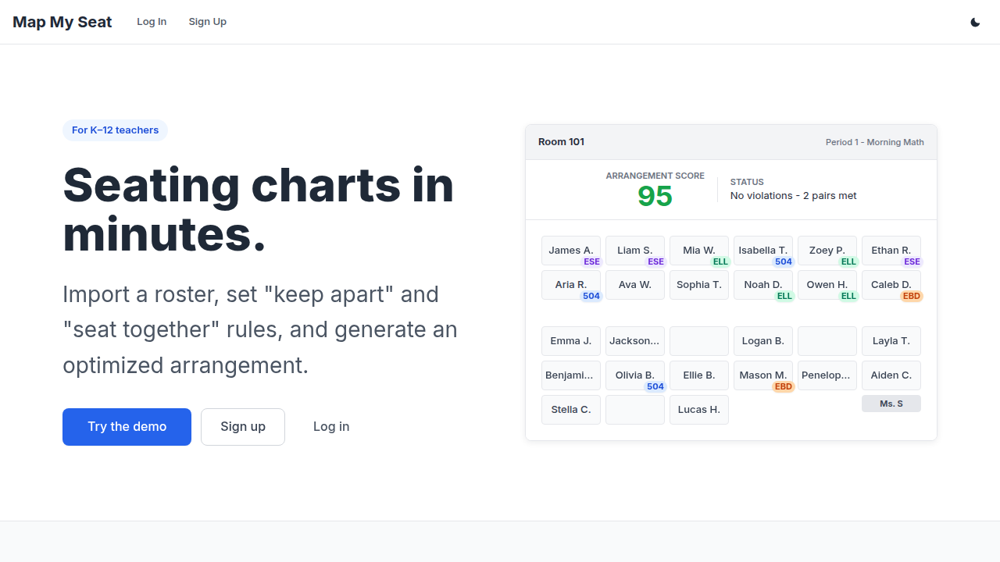
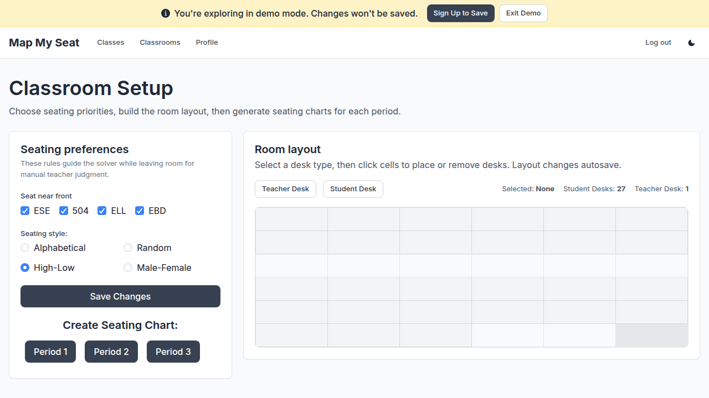
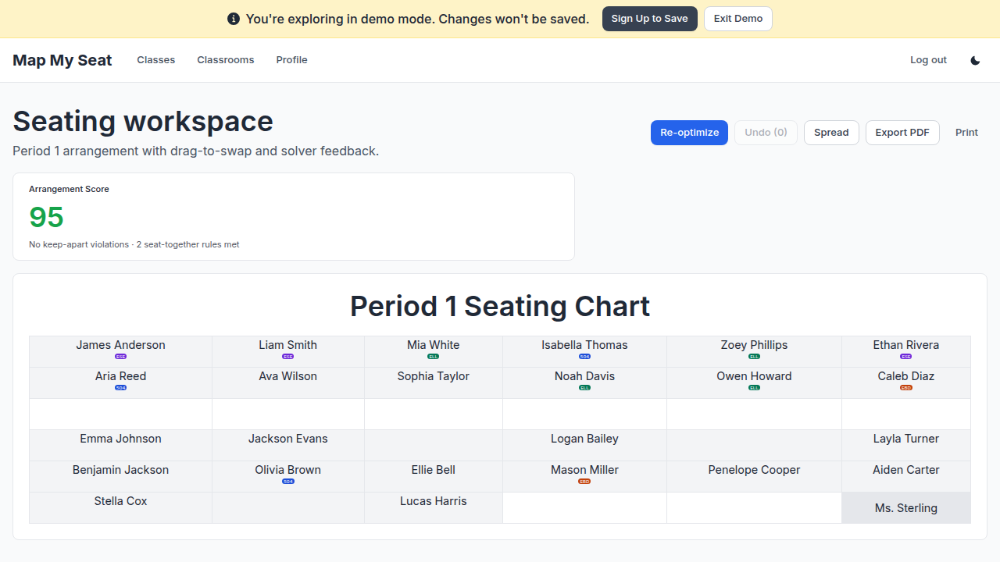

# Map My Seat

Automated seating chart generator for K-12 teachers. [Live demo](https://map-my-seat.vercel.app/).

## Overview

Map My Seat creates optimized classroom seating charts. Import a roster, design the room layout, set "keep apart" / "seat together" rules, and a simulated-annealing solver places students against a weighted objective covering constraint satisfaction, accommodations, and per-row balance.

For the design rationale — why simulated annealing over ILP or greedy, the objective function, and the "why this seat?" UX — see [docs/CASE_STUDY.md](docs/CASE_STUDY.md).

## Screenshots

| Landing | Classroom | Seating chart |
|:---:|:---:|:---:|
|  |  |  |

The seating-chart view shows the arrangement score, per-desk "why this seat?" tooltips, and drag-to-swap with Undo and Re-optimize.

## Features

- **Constraint solver** — simulated annealing over a weighted objective: -100 per "keep apart" pair adjacent, +10 per "seat together" pair adjacent, +5 for accommodation placement (504/EBD/ELL near front, ESE near aisle), plus a row-balance penalty for grade/gender clumping. Pure-JS, deterministic with an injectable RNG, runs in <300ms for 30 students.
- **Drag-to-swap** — swap any two students after the solver runs. Score updates live and flags hard-constraint breaks.
- **Re-optimize from current** — runs the solver forward from manual edits instead of starting over.
- **Per-desk rationale** — hover a desk to see why the solver placed a student there.
- **Student accommodations** — ESE, ELL, 504, and EBD flags with priority placement.
- **Flexible layouts** — grid-based desk editor with autosave.
- **CSV import** — bulk-upload rosters from gradebook exports.
- **PDF export** — print-ready charts.
- **Demo mode** — sample data preloaded, no signup needed.

## Local development

```bash
git clone https://github.com/gilhooley/map-my-seat.git
cd map-my-seat
npm run install:all
cp .env.example .env   # set DATABASE_URL and SECRET_KEY
npm run migrate
npm run dev
```

Frontend runs on http://localhost:5173, backend on http://localhost:3001.

## Stack

- **Frontend:** React 18, Vite, Chakra UI, React Router v6
- **Backend:** Node.js 18, Express, Knex.js, JSON Schema validation
- **Database:** PostgreSQL with versioned migrations
- **Auth:** JWT with bcrypt, rate-limited login endpoints
- **Deployment:** Vercel (frontend + serverless functions)

## API Documentation

All protected routes require a JWT token:
```
Authorization: Bearer <token>
```

### Auth
| Method | Endpoint | Description |
|--------|----------|-------------|
| POST | `/auth/register` | Create new account |
| POST | `/auth/token` | Login and receive JWT |

### Users
| Method | Endpoint | Description |
|--------|----------|-------------|
| GET | `/users/:username` | Get user profile |
| PATCH | `/users/:username` | Update profile |
| DELETE | `/users/:username` | Delete account |

### Periods
| Method | Endpoint | Description |
|--------|----------|-------------|
| GET | `/periods/:username` | List all periods |
| POST | `/periods/:username` | Create period |
| GET | `/periods/:username/:periodId` | Get period with students |
| PATCH | `/periods/:username/:periodId` | Update period |
| DELETE | `/periods/:username/:periodId` | Delete period |

### Students
| Method | Endpoint | Description |
|--------|----------|-------------|
| POST | `/periods/:username/:periodId/students` | Add student |
| PATCH | `/periods/:username/:periodId/students/:studentId` | Update student |
| DELETE | `/periods/:username/:periodId/students/:studentId` | Remove student |

### Classrooms
| Method | Endpoint | Description |
|--------|----------|-------------|
| GET | `/classrooms/:username/all` | List classrooms |
| POST | `/classrooms/:username` | Create classroom |
| PATCH | `/classrooms/:username/:classroomId` | Update classroom |
| DELETE | `/classrooms/:username/:classroomId` | Delete classroom |

### Seating Charts
| Method | Endpoint | Description |
|--------|----------|-------------|
| GET | `/classrooms/:username/:classroomId/seating-charts` | List charts |
| POST | `/classrooms/:username/:classroomId/seating-charts` | Generate chart |
| GET | `/classrooms/:username/:classroomId/seating-charts/:id` | Get chart |
| PATCH | `/classrooms/:username/:classroomId/seating-charts/:id` | Update chart |
| DELETE | `/classrooms/:username/:classroomId/seating-charts/:id` | Delete chart |

### Constraints
| Method | Endpoint | Description |
|--------|----------|-------------|
| GET | `/constraints/:username/:periodId` | List constraints |
| POST | `/constraints/:username/:periodId` | Create constraint |
| DELETE | `/constraints/:username/:periodId/:constraintId` | Delete constraint |

## Testing

Tests are colocated with source files. Backend uses Jest, frontend uses Vitest with React Testing Library.

```bash
npm test                  # all
npm run test:backend
npm run test:frontend
```

## Project structure

```
map-my-seat/
├── backend/
│   ├── middleware/        # JWT auth & authorization guards
│   ├── models/            # Database CRUD operations
│   ├── routes/            # RESTful API endpoints
│   ├── schemas/           # JSON Schema request validation
│   ├── helpers/           # Token generation, SQL utilities
│   └── migrations/        # Versioned database schema
├── frontend/
│   └── src/
│       ├── auth/          # Login, signup, user context
│       ├── classroom/     # Layout editor, classroom list
│       ├── common/        # Shared UI (ErrorBoundary, Toast, Loading)
│       ├── demo/          # Demo mode with in-memory simulation
│       ├── home/          # Landing page, dashboard
│       ├── hooks/         # useApi, useAutosave, useFormValidation
│       ├── navigation/    # Responsive nav with mobile support
│       ├── periods/       # Class period management
│       ├── profile/       # User profile editor
│       ├── seating/       # Chart generation & algorithms
│       └── students/      # Student CRUD, CSV import, constraints
├── api/                   # Vercel serverless function entry
├── vercel.json            # Deployment configuration
└── package.json           # Monorepo orchestration scripts
```

## Deployment

Deployed on Vercel as serverless functions. PostgreSQL via Neon/Supabase. See [DEPLOYMENT.md](DEPLOYMENT.md) for the full setup.

## License

MIT
