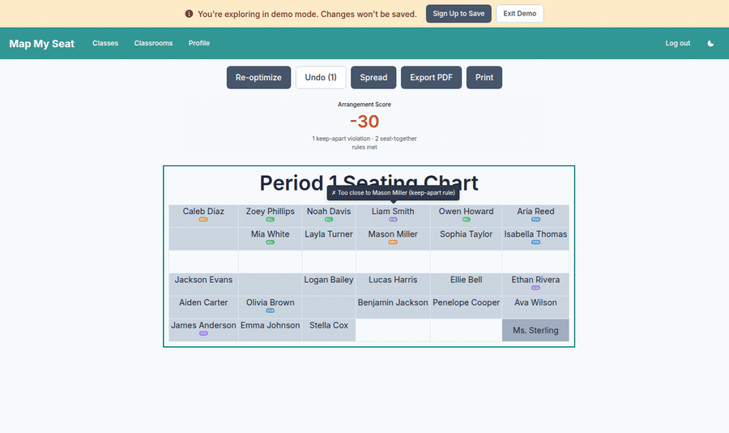

# Map My Seat — Technical Case Study

## The problem

A middle-school teacher walks into class with thirty students, four 504 plans,
two students who can't sit next to each other after a fight last week, and an
ELL student who needs to be near the front. By Friday she needs a printable
seating chart. Today she does this in a spreadsheet and re-does it every time
a student transfers in.

A pure sort can't solve this. The constraints are *pairwise* — "Liam apart
from Mason" depends on where both students end up, not on their individual
scores — so any objective that cares about constraints is non-decomposable.
Greedy placement gets stuck the first time it has to choose between
satisfying one rule and breaking another.

## Modeling the problem

I separated **hard constraints** (keep-apart pairs) from **soft preferences**
(accommodations, balance). Three approaches I considered:

- **ILP / CSP**: encode constraints as integer variables, hand to a solver.
  Guarantees feasibility. Adds a 200KB+ browser dependency, and
  "infeasible" is the wrong answer to give a teacher who needs *something*
  on paper Friday.
- **Greedy**: place hardest-to-place students first, fill the rest. Fast,
  but local minima everywhere — once two keep-apart students are placed, no
  greedy fix can rescue the chart without backtracking.
- **Simulated annealing** with a weighted objective: every violation costs
  points, but the teacher gets *an answer*. Hard violations carry a -100
  penalty, so the optimizer treats them as effectively-binding except when
  the constraint set is genuinely infeasible.

I went with the last one. It runs in the browser in <300ms for 30 students,
the objective is one pure function I can eyeball, and "best feasible attempt"
beats "no answer" for the user.

## The objective function

`scoreAssignment(assignment, context)` returns `{ total, breakdown,
violations }`. The weights, exposed as constants in
[objective.js](../frontend/src/seating/objective.js):

| Component             | Weight    | Triggers when                                       |
| --------------------- | --------- | --------------------------------------------------- |
| Hard violation        | **−100**  | "keep apart" pair seated at Chebyshev distance ≤ 1  |
| Pair satisfaction     | **+10**   | "seat together" pair adjacent (distance == 1)       |
| Accommodation — front | **+5**    | 504 / EBD / ELL student within 2 rows of the front  |
| Accommodation — aisle | **+5**    | ESE student at row edge or next to teacher desk     |
| Front-row priority    | **+10**   | Priority-flagged accommodation in row 0             |
| Balance penalty       | **−1 × σ** | Per-row stddev of grade or M/F ratio               |

Tuning these is the design surface. −100 for hard violations is large enough
to dominate any combination of soft bonuses, so the optimizer never trades
a keep-apart breach for cosmetics.

## Simulated annealing in 30 lines

The core loop, lifted from [solver.js](../frontend/src/seating/solver.js):

```js
const cooling = Math.pow(Tmin / T0, 1 / Math.max(iterations, 1));
let T = T0;

for (let i = 0; i < iterations; i++) {
  const a = Math.floor(rng() * seats.length);
  const b = Math.floor(rng() * seats.length);
  if (a === b) { T *= cooling; continue; }
  if (assignment[a] == null && assignment[b] == null) { T *= cooling; continue; }

  // Try a 2-seat swap.
  const tmp = assignment[a];
  assignment[a] = assignment[b];
  assignment[b] = tmp;
  const newScore = scoreAssignment(assignment, context).total;
  const delta = newScore - currentScore;

  // Always accept improvements; sometimes accept regressions.
  const accept = delta > 0 || rng() < Math.exp(delta / T);
  if (accept) {
    currentScore = newScore;
    if (newScore > bestScore) {
      bestScore = newScore;
      bestAssignment = assignment.slice();
    }
  } else {
    assignment[b] = assignment[a];   // revert
    assignment[a] = tmp;
  }
  T *= cooling;
}
```

2000 iterations. T cools geometrically from 10 to 0.01. The legacy
`sortAndPrioritizeStudents` provides the seed, so an unconstrained classroom
behaves identically to the previous version — the solver only earns its keep
when there's something to optimize. RNG is injectable (`mulberry32(seed)`),
which makes unit tests fully deterministic.

## The "why this seat?" UX

Black-box optimization erodes user trust — "the computer said so" doesn't fly
when a parent emails about why their kid is in the back row. So every desk
gets a hover tooltip generated by `seatRationale(seatIndex, ...)`:

> ✓ Apart from Mason Miller
> ✓ Front row (504 accommodation)
> ✓ Next to Olivia Brown (seat-together rule)

The tooltip uses the same constraint-evaluation code that scored the
assignment — there's no chance of the rationale and the score disagreeing.
When a manual drag breaks a rule, the offending desks immediately surface a
red `✗ Too close to Mason Miller` line on the moved student's tooltip, and
the score badge flips red:



See [demo.gif](screenshots/demo.gif) for the full sequence: score
75 → −30 → 80 across drop, view, re-optimize.

## What I'd do next

- **Multi-period optimization.** A student often appears across periods.
  Lock them to "the same seat where reasonable" so they aren't relearning
  the room every block.
- **ILP fallback.** When the solver lands at −100 (a hard violation that
  annealing couldn't shake), flip on an ILP-based feasibility check to tell
  the teacher *which* constraints are mutually unsatisfiable.
- **Accessibility constraints.** Wheelchair near door, vision near board.
  Fits the existing weights vocabulary cleanly.
- **User study.** Sit with three teachers, watch them use it, find the
  things I built that they don't actually need.

## What I learned

- **Pure functions made the solver trivial to test deterministically.**
  Both `scoreAssignment` and the cooling loop take an injected RNG; every
  test in [solver.test.js](../frontend/src/seating/solver.test.js) is
  reproducible with a single `mulberry32(seed)`.
- **`seatGrid` adjacency was the most reused abstraction.** It started as a
  helper for the objective. Then drag-and-drop reused `matrixToSeats` to
  resolve a `dropTarget` event back to a seat. Then the rationale generator
  reused `distance`. Three uses, one ~40-line module — the kind of leverage
  you only see in retrospect.
- **A score badge that turns red is a better UX than a modal.** Most "manual
  swap broke a rule" feedback I considered (toasts, banners, blocking the
  drop) felt either nagging or paternalistic. The badge shows the cost; the
  user decides whether they care.
